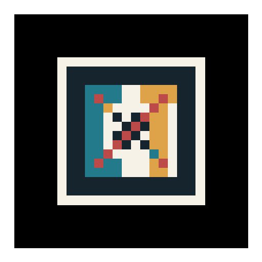

# ControlTask — Marker-Based Augmented Reality

AR.js web app that anchors the **Ding-dong** mathematical surface (from PA#1) to a custom
printed registration pattern, viewable on any smartphone browser without installing an app.

---

## Demo images

| Printable marker | App preview |
|:---:|:---:|
|  | open `ControlTask/preview.html` |

> **Video** — recorded demo is committed to this branch as `demo.mp4`.

---

## How to run on your phone

1. Serve the repo root from any static HTTP server, e.g.
   ```bash
   npx serve .
   # or
   python -m http.server 8080
   ```
2. Open `http://<your-local-ip>:8080/ControlTask/` in your **phone browser** (Chrome or Safari).
3. Allow camera access when prompted.
4. Point the camera at the printed marker — the Ding-dong surface appears above it.

> The page works over plain HTTP on a local network. HTTPS is required only when hosting on a public server.

---

## Files

```
ControlTask/
├── index.html                  — AR.js scene (A-Frame + AR.js)
├── app.js                      — dingdong-surface A-Frame component
├── preview.html                — static presentation screenshot (1280×720)
└── assets/
    ├── controltask-marker.png  — printable registration template (print at ≥ 8×8 cm)
    └── pattern-controltask.patt — AR.js pattern descriptor for the marker
```

---

## Surface

The augmented object is the **Ding-dong** surface defined by

```
x² + y² = k(1 − z)z²,   z ∈ [−1, 1]
```

The same equation was used as the main subject in PA#1 (WebGL) and PA#2/PA#3.

The A-Frame component in `app.js` builds a `THREE.BufferGeometry` from that parametric
formula, applies a `MeshStandardMaterial`, adds outline `LineSegments`, and animates a
slow rotation + breathing scale each frame via the `tick()` hook.

---

## Marker

The registration pattern was generated with the
[AR.js marker creator](https://jeromeetienne.github.io/AR.js/three.js/examples/marker-training/examples/generator.html).
The result is stored as both a PNG image (for printing) and a `.patt` descriptor file
(loaded by AR.js at runtime via `<a-marker type="pattern" url="...">`).

**Print instructions:** print `controltask-marker.png` at ≥ 8 × 8 cm on white paper, cut
out the white border included in the image, and glue or tape it flat to the chosen object.

---

## Tech stack

| Library | Version | Role |
|---|---|---|
| [A-Frame](https://aframe.io) | 1.6.0 | 3-D scene graph on top of WebGL |
| [AR.js](https://ar-js-org.github.io/AR.js-Docs/) | 3.4.8 | Marker tracking via camera |
| Three.js | (bundled with A-Frame) | Geometry & materials |
